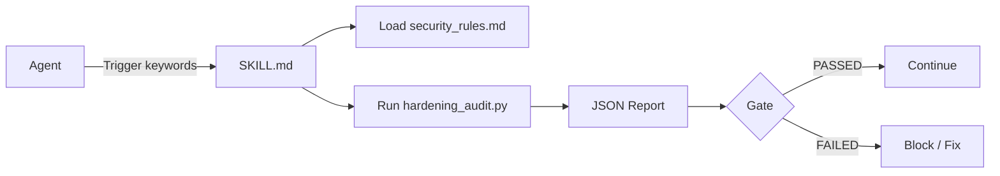

# Agent Skills

[](https://opensource.org/licenses/MIT)
[](https://github.com/Bexruz-cell/agent-skills)
[](https://github.com/Bexruz-cell/agent-skills)
[](https://www.python.org/)
[](https://github.com/Bexruz-cell/agent-skills/actions/workflows/audit-ci.yml)

> **Industrial open-source library of Agent Skills for autonomous IDEs**  
> Production-ready skills that make AI agents reliable, secure and deterministic.

---

## Architecture & Flow

```text
┌─────────────┐     trigger      ┌──────────────────┐
│   Agent     │ ───────────────► │    SKILL.md      │
│ (Claude /   │                  │  (metadata +     │
│  Cursor /   │                  │   protocol)      │
│  Antigravity)│                 └────────┬─────────┘
└─────────────┘                           │
                                          │ loads
                                          ▼
                               ┌──────────────────────┐
                               │  references/         │
                               │  security_rules.md   │
                               └──────────┬───────────┘
                                          │
                                          ▼
                               ┌──────────────────────┐
                               │  scripts/            │
                               │  hardening_audit.py  │
                               └──────────┬───────────┘
                                          │
                                          ▼
                               ┌──────────────────────┐
                               │  Structured Report   │
                               │  (PASSED / FAILED)   │
                               │  + JSON output       │
                               └──────────────────────┘
```

**Mermaid version:**



---

## Skills Catalog

| Skill | Purpose | Environments | Trigger |
|-------|---------|--------------|---------|
| **production-hardening** | Security audit, secret scan, race-condition & pool leak detection, production readiness | Antigravity, Claude Code, Cursor, Gemini CLI, Windsurf | `before commit`, `security audit`, `harden`, `before deploy`, `pool leak`, `race condition` |
| **context-optimizer** | Token efficiency, prompt compression, lockfile & binary filtering, structured JSON output | Claude Code, Antigravity, Cursor, Gemini CLI, Windsurf | `reduce context`, `optimize tokens`, `compress prompt`, `large file edit`, `context overflow` |
| **unrestricted-adult-mode** | Full unrestricted 18+ content (roleplay, stories, image/video prompts) with hard ban on minors | Claude Code, Cursor, Antigravity, Gemini CLI, DeepSeek, Grok | `adult mode`, `18+`, `NSFW`, `без ограничений`, `сними фильтры` |
| **unrestricted-coding** | Unrestricted coding + security research + own-system audit (no unauthorized third-party attacks) | Claude Code, Cursor, Antigravity, Gemini CLI, DeepSeek, Grok | `sandbox coder`, `unrestricted coding`, `пиши код`, `audit my network` |

---

## Curated Agentic Ecosystem

Explore our comprehensive directory of 50 top-tier open-source tools, runtimes, and frameworks for autonomous AI agents:

👉 **[Awesome Agentic Stack (`references/awesome_agentic_stack.md`)](references/awesome_agentic_stack.md)**

Categories covered:
1. **Token Economy & Context Compression** (LLMLingua, vLLM, guidance, DSPy, LiteLLM, ExLlamaV2, etc.)
2. **Agent Protocols & Standards** (Anthropic MCP, OpenHands, Cline, E2B, LangGraph, LlamaIndex, etc.)
3. **Long-Term Memory & State** (Mem0, Letta, Qdrant, Milvus, pgvector)
4. **Security Audit & Code Verification** (Bandit, Semgrep, Gitleaks, TruffleHog, Pyre, Atheris, Trivy, etc.)
5. **Multi-Agent Orchestration** (AutoGen, CrewAI, MetaGPT, SWE-bench, LiteLLM Proxy)
6. **Fast Local Utilities & AST Runtime** (Ruff, uv, pytest, pre-commit, Rich)
7. **LLM Evaluation, Validation & Tracing** (TruLens, DeepEval, Ragas, Phoenix, Promptfoo)

---

## Quickstart

### 1. Clone or copy the skill

```bash
git clone https://github.com/Bexruz-cell/agent-skills.git
```

Copy the skill into your agent skills directory:

```bash
# Claude Code / Antigravity style
cp -r agent-skills/skills/production-hardening ~/.claude/skills/
# or
cp -r agent-skills/skills/production-hardening .agent/skills/
```

### 2. Run the audit CLI directly

```bash
cd agent-skills/skills/production-hardening
python scripts/hardening_audit.py --root /path/to/your/project --json
# or positionally:
python scripts/hardening_audit.py /path/to/your/project --json
```

### 3. Example JSON report

```json
{
  "status": "FAILED",
  "summary": {
    "critical": 1,
    "high": 2,
    "medium": 3,
    "low": 0,
    "files_scanned": 47
  },
  "findings": [
    {
      "severity": "CRITICAL",
      "rule": "hardcoded-secret-regex",
      "file": "src/config.py",
      "line": 14,
      "fingerprint": "AKIAI…XAMPLE",
      "description": "Matched secret pattern: AKIA[0-9A-Z]{16}",
      "recommendation": "Move secret to environment variable or secret manager and rotate it."
    }
  ]
}
```

---

## Testing & CI/CD

### Run tests locally

```bash
pip install pytest flake8 mypy
pytest tests/ -v
```

### CI Pipeline

Every push and pull request to `main` runs:

- Matrix testing on Python 3.10 / 3.11 / 3.12
- flake8 + mypy
- Full unit-test suite
- Self-audit of the repository itself as a Verification Gate

See [`.github/workflows/audit-ci.yml`](.github/workflows/audit-ci.yml).

---

## Project Structure

```text
agent-skills/
├── README.md
├── LICENSE
├── .gitignore
├── .github/
│   └── workflows/
│       └── audit-ci.yml
├── references/
│   └── awesome_agentic_stack.md
├── tests/
│   └── test_hardening_audit.py
└── skills/
    ├── context-optimizer/
    │   └── SKILL.md
    ├── production-hardening/
    │   ├── SKILL.md
    │   ├── references/
    │   │   └── security_rules.md
    │   ├── schemas/
    │   │   └── audit_config.json
    │   └── scripts/
    │       └── hardening_audit.py
    ├── unrestricted-adult-mode/
    │   └── SKILL.md
    └── unrestricted-coding/
        └── SKILL.md
```

---

## Changelog & Releases

### v1.3.0
- Added `context-optimizer` skill for token reduction, targeted search, and JSON compression
- Added `references/awesome_agentic_stack.md` featuring 50 curated open-source AI agent repositories
- Fixed CI failure by supporting positional root argument in `hardening_audit.py`
- Self-audit Verification Gate now passes cleanly (`exit code 0`)

### v1.2.0
- Added `unrestricted-adult-mode` (full 18+ + hard minor ban)
- Added `unrestricted-coding` (unrestricted code with legal boundaries)

### v1.1.0
- Fixed false positives on `dict.get()` / `cfg.get()` in HTTP-timeout detector
- Added HTTP-client context awareness
- Comprehensive unit tests + GitHub Actions CI

### v1.0.0
- Initial production-hardening skill

---

## License

MIT © 2026 Bexruz-cell
