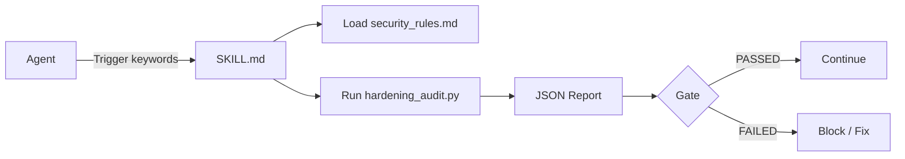

# Agent Skills

[](https://opensource.org/licenses/MIT)
[](https://github.com/Bexruz-cell/agent-skills)
[](https://github.com/Bexruz-cell/agent-skills)
[](https://www.python.org/)

> **Industrial open-source library of Agent Skills for autonomous IDEs**  
> Production-ready skills that make AI agents reliable, secure and deterministic.

---

## Architecture & Flow

```text
┌─────────────┐     trigger      ┌──────────────────┐
│   Agent     │ ───────────────► │    SKILL.md      │
│ (Claude /   │                  │  (metadata +     │
│  Cursor /   │                  │   protocol)      │
│  Antigravity)│                 └────────┬─────────┘
└─────────────┘                           │
                                          │ loads
                                          ▼
                               ┌──────────────────────┐
                               │  references/         │
                               │  security_rules.md   │
                               └──────────┬───────────┘
                                          │
                                          ▼
                               ┌──────────────────────┐
                               │  scripts/            │
                               │  hardening_audit.py  │
                               └──────────┬───────────┘
                                          │
                                          ▼
                               ┌──────────────────────┐
                               │  Structured Report   │
                               │  (PASSED / FAILED)   │
                               │  + JSON output       │
                               └──────────────────────┘
```

**Mermaid version:**



---

## Skills Catalog

| Skill | Purpose | Environments | Trigger |
|-------|---------|--------------|---------|
| **production-hardening** | Security audit, secret scan, race-condition & pool leak detection, production readiness | Antigravity, Claude Code, Cursor, Gemini CLI, Windsurf | `before commit`, `security audit`, `harden`, `before deploy`, `pool leak`, `race condition` |

---

## Quickstart

### 1. Clone or copy the skill

```bash
git clone https://github.com/Bexruz-cell/agent-skills.git
```

Copy the skill into your agent skills directory:

```bash
# Claude Code / Antigravity style
cp -r agent-skills/skills/production-hardening ~/.claude/skills/
# or
cp -r agent-skills/skills/production-hardening .agent/skills/
```

### 2. Run the audit CLI directly

```bash
cd agent-skills/skills/production-hardening
python scripts/hardening_audit.py --root /path/to/your/project --json
```

### 3. Example JSON report

```json
{
  "status": "FAILED",
  "summary": {
    "critical": 1,
    "high": 2,
    "medium": 3,
    "low": 0,
    "files_scanned": 47
  },
  "findings": [
    {
      "severity": "CRITICAL",
      "rule": "hardcoded-secret-regex",
      "file": "src/config.py",
      "line": 14,
      "fingerprint": "AKIAI…XAMPLE",
      "description": "Matched secret pattern: AKIA[0-9A-Z]{16}",
      "recommendation": "Move secret to environment variable or secret manager and rotate it."
    }
  ]
}
```

---

## Project Structure

```text
agent-skills/
├── README.md
├── LICENSE
└── skills/
    └── production-hardening/
        ├── SKILL.md
        ├── references/
        │   └── security_rules.md
        ├── schemas/
        │   └── audit_config.json
        └── scripts/
            └── hardening_audit.py
```

---

## License

MIT © 2026 Bexruz-cell
